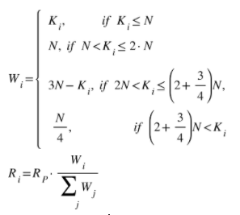
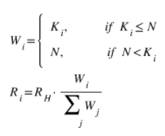

# Incentive Mechanism for BSC Relayer 

The BSC relayers play an important role in relaying interchain packages from BC to BSC.
All BSC relayers build their stable infrastructure, watch any event happened on the Binance Chain, and act timely to get paid accordingly. The following discussion is about how to distribute the rewards to let the relayers are willing to make a long-term contribution.

## Principle
Considering the following points:

1. Fairness, competitiveness, and redundancy: Everyone has a chance to run a relayer even on cheap hardware. It should be hard for someone to get all the rewards.
2. Simplicity.
3. Robustness: The relayer may have a strategy to make its largest profit accordingly, under any condition, the interchain communication should not be blocked.
4. Low Risk: The relayer should take a little risk to play in this game. For the top N relayers, they should gain enough rewards to cover the cost.

It is tough hard to achieve all these goals; we make some trade-off on robustness and low risk in the following design.

## Rewards Source and Allocation

We have three reward source:

1. Users paid reward: Users who send `bind` or `cross chain transfer` transactions need to pay extra fee as bsc-relayer rewards.
2. System reward: Rewards comes from `SystemReward` contract.

The role of relayers and their rewards comes from:

| Relayer Behavior | Rewards come from |
| --------------------------------------------------- | ------------- |
|User packages(bind, unbind, transfer) from BC to BSC | Users pay for the reward |
|System packages(staking, slash, governance) from BC to BSC | System reward |
|Relayer for sync tendermint header to light client contract  |System reward|

## Rewards Distribution Formula

To prevent the relayer who has the best network always winning the game, we gather the reward into two reward pools (header relayer reward pool and package relayer reward pool) and reallocate to the relayers to achieve redundancy:

1. *S* is a constant number of transactions that in around. Each round, there are *S* transactions, and the last transaction of the round will trigger reward distribution.
2. *N* is the maximum weight that a relayer can gain in a round. *R* is the total reward in this round. *Ki* is the number of successful transactions from Relayer i. *Wi* is the reward weight of Relayer i. *Ri* is the rewards of Relayer i.
3. *R* is the total reward in this round.
4. *Ki* is the number of successful transactions from Relayer i.
5. *Wi* is the reward weight of Relayer i.
6. *Ri* is the rewards of Relayer i.

### Weight formula for package relayers:

`Rp` represents the total balance of package reward pool.

### Weight formula for header relayers:

`Rh` represents the total balance of header reward pool.

### We consider setting these parameters a reasonable value:

1. S to be 100. Some rewards come from gas fee, we can not guarantee enough rewards during a small round, a large round may dismiss deviation and let relayer give up relaying when it has made its max profit.
2. N to be 40. We think the redundancy of relayer around 3-5 is best. If N is too large, the redundancy will decrease, if too small there are no enough relayers. Set N as 40 may be a reasonable value, at least 3 relayers can compete.
3. The relayFee of a single package and the ratio of reward for header relayer can be modified by governance on Binance Chain.

### Distribution And Claim Reward

In each round, the last package delivery transaction will trigger the reward distribution. Both the header reward pool and package reward pool will be distributed. However, the reward won't be paid directly to relayer accounts. The distribution algorithm just calculates rewards for all relayers and write down the amounts. Relayers are required to actively send transactions to claim their own accumulated rewards.

## Other Consideration

### System Reward Pool

The system reward pool can hold at most 100BNB for example, to prevent the pool get unnecessary income.

The client needs to query the balance of the contract to decide whether to distribute 1/16 of the transaction fee to the contract or not. It seems not that fair that some validators pay more to the reward pool than others, but this is random and will eventually become fair in the long run.

If there are not enough rewards in the pool, all the tokens in the pool will be distributed.

Block header sync transaction with `validatorSet` change will claim reward to relayers from system reward pool directly.

### Foul Play

For example, a relayer may deliver packages using a different address in round robin, we can’t recognize this. We try to introduce registration and BNB deposit for relayer to raise the cost of cheat.  How it works:

* A BSC account needs call `register` of [RelayerHub](https://bscscan.com/address/0x0000000000000000000000000000000000001006) contract to deposit 100BNB(more or less than 100 BNB will be rejected) to become a BSC relayer.
* Only a valid relayer can sync Binance Chain Headers and deliver cross-chain packages.
* Relayer can withdraw its deposit, but we will charge 0.1 BNB as the transaction fee so that it will receive 99.9 BNB back.
* The charged fee will directly go to system reward pool.
